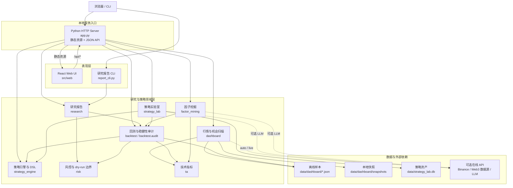

# web3-quant-sandbox

[中文](README.md) | [English](README.en.md)

离线优先的 Web3 量化研究沙箱。它把市场总览、机会雷达、因子挖掘、数据源监控、策略回测、风险审计、模拟交易工作站、策略 DSL 和研究报告放在同一个本地应用里，方便学习、教学、策略原型验证和 Codex 交付课程演示。

默认情况下，本项目使用仓库内置样本和快照运行；不会连接真实交易账户，不管理钱包，也不会提交真实订单。

> 如果这个项目帮助你学习 Web3 量化、回测工程或 Codex 课程流程，欢迎 Star。想接入自己的数据源、改策略或搭建私有研究面板，可以 Fork 后继续扩展。

Fork 后长期维护时，请从功能分支向自己的 `main` 提交定制，并通过同步 PR 引入作者更新。仓库内的[定制说明](docs/customization.md)和[上游同步手册](docs/maintenance/upstream-sync.md)记录了分支、自动化、冲突处理与验收边界。

## 项目亮点

- **离线优先**：内置 `data/dashboard/*.json` 样本，断网也能打开核心页面。
- **公益学堂**：`/academy` 汇集量化数学、回测、K 线、诊断分析、资产管理和风控六类课程；数学、K 线、回测与风控提供 169 个核心公式、43 份章节导学、复算任务、常见误区、全库检索、学习进度与权威延伸阅读。全部 165 个不重复公式都有公式级“公式史档案”，明确提出者或系统化者、产生背景、思想来源、推导链、传播路径、现代演化和参考资料；没有单一作者的公式会如实标记为长期演化形成。公式库支持按 Markowitz、Wilder、Bayes 等人物以及思想和历史背景检索，并展示“思想来源 → 公式 → 量化应用”谱系。章节进度不再依赖手动勾选：学习者必须通过公式识别、使用边界和历史来源三类掌握度检查。K 线、回测与风控另配互动演练。
- **研究闭环完整**：覆盖行情总览、机会扫描、因子挖掘、数据源状态、策略回测、风险复核、模拟执行和研究报告。
- **模拟交易工作站**：`/live-trading` 提供 K 线主画布、周期切换、交易计划线、dry-run 票据和证据面板。
- **风险边界明确**：dry-run 只记录研究动作；项目默认不接交易所写接口、不提交真实订单。
- **策略与指标可扩展**：包含 MA、MACD、BOLL、RSI、资金费率、因子挖掘和滚动回测示例。
- **前后端一体**：Python 本地服务 + React / Ant Design / lightweight-charts 前端。
  
配套课程：http://gk.link/a/12KKG

## 界面预览


## 代码架构

项目采用前后端一体的本地应用架构：`app.py` 同时托管构建后的 React 页面和 JSON API，并把请求分发到行情研究、回测审计、因子挖掘、策略实验室等领域模块。默认数据流优先读取仓库内的离线样本或快照；只有显式启用 `auto` / `live` 模式时才访问在线数据源。



图中的在线依赖均为可选项；策略执行保持模拟和只读研究边界，不会向交易所提交真实订单。

## 快速开始

### 环境要求

- Python 3.11+
- Node.js 18+
- npm

### Windows PowerShell

```powershell
py scripts/course.py setup
py app.py
```

如果本机没有可用的 `py` 启动器，可以改用：

```powershell
python scripts/course.py setup
python app.py
```

启动后打开：

```text
http://127.0.0.1:8765
```

常用页面：

| 页面 | 地址 |
| --- | --- |
| 市场总览 | `http://127.0.0.1:8765/trading` |
| 机会雷达 | `http://127.0.0.1:8765/radar` |
| 因子挖掘 | `http://127.0.0.1:8765/factor-mining` |
| 数据源监控 | `http://127.0.0.1:8765/data-sources` |
| 策略回测 | `http://127.0.0.1:8765/backtests` |
| 模拟交易工作站 | `http://127.0.0.1:8765/live-trading` |
| 风控中心 | `http://127.0.0.1:8765/risk` |
| 策略 DSL | `http://127.0.0.1:8765/strategy` |
| 市场情报 | `http://127.0.0.1:8765/research` |

### macOS / Linux

```bash
make setup
python app.py
```

## 主要能力

| 能力 | Web 路由 | 主要代码路径 | 说明 |
| --- | --- | --- | --- |
| 市场总览 | `/trading` | `src/dashboard/`, `src/web/src/pages/trading/DashboardPage.tsx` | 多资产行情、K 线、交易信号、风险摘要和执行入口 |
| 公益学堂 | `/academy`、`/math-learning`、`/backtest-learning`、`/kline-learning`、`/diagnosis-learning`、`/asset-management-learning`、`/risk-learning` | `src/web/src/pages/learning/` | 量化数学、回测、K 线、诊断分析、资产管理和风控课程；包含 169 个公式、43 份公式章节导学、10 章应用案例、搜索、证据式掌握检查、公式历史/推导档案、误区与权威来源 |
| 机会雷达 | `/radar` | `src/dashboard/opportunity.py`, `src/web/src/pages/trading/RadarPage.tsx` | 基于资金、趋势、链上和风险信号扫描机会，区分热路径、冷路径和风控阻断 |
| 因子挖掘 | `/factor-mining` | `src/factor_mining/`, `src/web/src/pages/trading/FactorMiningPage.tsx` | GP/ML/模板/LLM 候选生成、IC/RIC 验证；通过 `backtest_spec` 交接到策略回测 |
| 数据源监控 | `/data-sources` | `src/dashboard/snapshot.py`, `src/dashboard/catalog.py` | 查看离线样本、在线快照、API 状态和研究草稿门禁 |
| 策略回测 | `/backtests` | `src/backtest/`, `src/backtest/rolling/` | 单策略、窗口对比、walk-forward、组合和稳健性检查；消费已交接的挖掘因子 |
| 模拟交易工作站 | `/live-trading` | `src/web/src/pages/trading/LiveTradingPage.tsx`, `src/risk/`, `src/strategy_engine/` | 样本数据驱动的 dry-run 执行界面，不是实盘终端 |
| 风控中心 | `/risk` | `src/risk/`, `src/backtest/audit/` | 回撤、止损、拒单、CPCV、PBO、DSR 等风险视角 |
| 策略 DSL | `/strategy` | `src/strategy_engine/dsl/` | AST 白名单、import 限制、前视偏差检查和编译验证 |
| 市场情报 | `/research` | `src/research/`, `src/dashboard/llm_signal.py` | 研究摘要、来源卡片和可选 LLM 信号分析 |
| CLI 报告 | 无 | `report_cli.py`, `src/research/report.py` | 输出 summary 或 JSON 研究报告 |

## 模拟交易工作站

`/live-trading` 是研究流程中的模拟执行入口，不是实盘交易终端。它按交易工作站的信息架构组织：

- **左侧情报栏**：展示当前交易对、参考价格、信号结论、置信度、风险状态和 AI Picks 队列。
- **中央 K 线主画布**：使用 lightweight-charts 展示蜡烛图、成交量、MA20、MA60，并叠加信号给出的入场、止损和目标价线。
- **周期切换**：支持 `15m / 1h / 4h / 1D` K 线周期。
- **右侧 dry-run 票据**：输入交易对、方向、场地、金额、滑点容忍度、延迟和确认词，只生成模拟审计记录。
- **证据面板**：用分段控件切换市场、信号、风险、账本和系统假设，减少首屏噪声。
- **浅色/深色主题**：浅色模式偏向研究仪表盘，深色模式保留交易终端质感。

## 数据模式

Dashboard 数据主要来自三类来源：

1. `data/dashboard/*.json`：仓库内置离线样本，断网也能运行。
2. `data/dashboard/snapshots/`：在线抓取后落盘的快照。
3. 在线 API：仅在配置密钥并启用 `DASHBOARD_DATA_MODE=auto` 或 `DASHBOARD_DATA_MODE=live` 时使用。

Binance 行情接入说明：
- 运行时数据源通过 `.env` 中的 `DASHBOARD_MARKET_PROVIDER=binance`、`BINANCE_PUBLIC_API_BASE` 和可选 `BINANCE_API_KEY` 配置，项目代码调用 Binance 官方 REST API。
- Binance Skills Hub / Codex Binance skills 用于开发期查询、字段核对和示例验证；它们属于 Codex 会话工具，不能作为应用运行时依赖。
- `auto` 模式会先返回完整 snapshot/fixture，再在后台刷新；需要立即验证 Binance 实时数据时，可调用接口时传 `refresh=True` 或临时使用 `DASHBOARD_DATA_MODE=live`。

常用数据命令：

| 命令 | 作用 |
| --- | --- |
| `py scripts/course.py snapshot` | 联网抓取 dashboard 数据并写入快照 |
| `py scripts/course.py sync-fixtures` | 将完整快照同步为内置样本 |
| `py scripts/course.py save-offline-data` | 抓取快照并同步离线样本 |
| `py scripts/course.py build-fixtures` | 用快照或种子数据补齐样本 |

可以复制 `.env.example` 为 `.env` 后按需配置。未配置 API 密钥时，应用仍会使用离线样本正常启动。

## 命令行报告

```powershell
python report_cli.py --format summary
python report_cli.py --format json --short 3 --long 7
```

报告内容来自 `src/research/report.py`，会合并样本数据、回测指标、风险检查和执行边界说明。

## 前端开发

生产模式由 `app.py` 直接服务 `src/web/static/`。开发前端时可以同时启动 Vite：

```powershell
py app.py
cd src/web
npm run dev
```

单独构建前端：

```powershell
cd src/web
npm run build
```

## 验证

编辑期间建议运行：

```powershell
py scripts/course.py verify
```

在当前 Windows 环境中，如果 `py` 启动器不可用，可以使用仓库虚拟环境：

```powershell
.\.venv\Scripts\python.exe scripts\course.py verify
```

仓库级变更完成前运行：

```powershell
py scripts/course.py check
```

`check` 会额外执行实现矩阵、资产审计和课程文档检查。所有检查只依赖公开仓库中的文件。编辑教学图脚本后，重新生成教学图：

```powershell
py scripts/course.py teaching-plots
```

## 项目结构

```text
.
|-- app.py                     # 本地 HTTP 服务，默认 127.0.0.1:8765
|-- report_cli.py              # 命令行研究报告
|-- verify.py                  # 产品验证入口
|-- scripts/
|   `-- course.py              # setup / verify / check / snapshot 等任务
|-- src/
|   |-- backtest/              # 回测、滚动窗口、审计指标
|   |-- config/                # 环境变量和上游配置
|   |-- dashboard/             # 行情、快照、机会扫描、API 适配
|   |-- data/                  # point-in-time 数据工具
|   |-- factor_mining/         # 因子挖掘与因子回测
|   |-- research/              # 研究报告组装
|   |-- risk/                  # 风控规则和模拟边界
|   |-- strategy_engine/       # 事件驱动策略引擎与 DSL
|   |-- ta/                    # 技术指标工具
|   `-- web/                   # React + Ant Design 前端
|-- data/                      # 离线样本和 dashboard 快照
|-- skills/                    # 课程沉淀的 Codex 技能
|-- tests/                     # pytest 测试
`-- outputs/                   # 生成产物
```

## 适合谁使用

- 想零资金风险学习 Web3 量化和程序化交易的新手。
- 需要本地回测、风控审计和策略验证样例的开发者。
- 想把 Codex 用到研究、实现、验证、文档交付流程里的课程学员。
- 想搭建私有模拟交易面板、机会雷达或研究报告流水线的工程师。

## 二次开发入口

| 目标 | 推荐入口 |
| --- | --- |
| 新增市场数据或快照来源 | `src/dashboard/`, `dashboard_snapshot.py`, `scripts/build_dashboard_fixtures.py` |
| 新增回测策略 | `src/backtest/rolling/strategies/` |
| 新增技术指标 | `src/ta/`, `src/backtest/rolling/indicators.py` |
| 扩展因子挖掘 | `src/factor_mining/` |
| 调整模拟交易和风控 | `src/web/src/pages/trading/LiveTradingPage.tsx`, `src/risk/`, `src/strategy_engine/` |
| 修改 Web 页面 | `src/web/src/pages/trading/`, `src/web/src/components/` |

有通用价值的策略、指标、数据源适配或课程修正，欢迎提交 PR。

## GitHub 首页建议

为了让更多人能在 GitHub 搜到这个项目，建议在仓库右侧 About 区域补全：

**Description**

```text
离线 Web3 量化沙箱：本地模拟交易、链上/CEX 策略回测、机会雷达、风险审计和可视化研究面板。
```

**Topics**

```text
web3, quant, crypto-trading, backtest, trading-sandbox, algorithmic-trading, python-quant, trading-bot, react, codex
```

## 安全边界

- 默认不连接真实交易所账户或钱包。
- `/live-trading` 是模拟交易工作站，不是实盘交易终端。
- dry-run 只记录研究动作，不提交真实订单。
- 策略 DSL 会做 AST 白名单、import 限制和前视偏差检查。
- 在线数据仅用于研究展示和回测输入，不构成投资建议。
- API 密钥只应通过本地 `.env` 读取，不应提交到仓库。

## 开源协议

本项目是 MIT 协议开源项目，详见 [LICENSE](LICENSE)。

作者：袁从德

联系方式：congdeyuan@gmail.com
交流群： 

